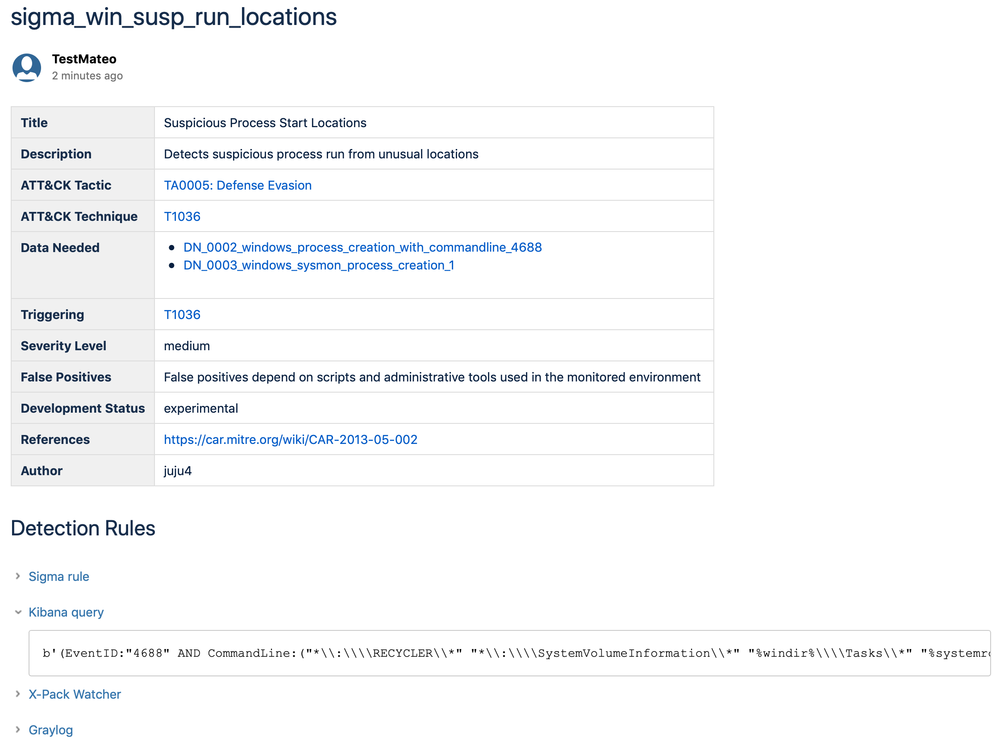
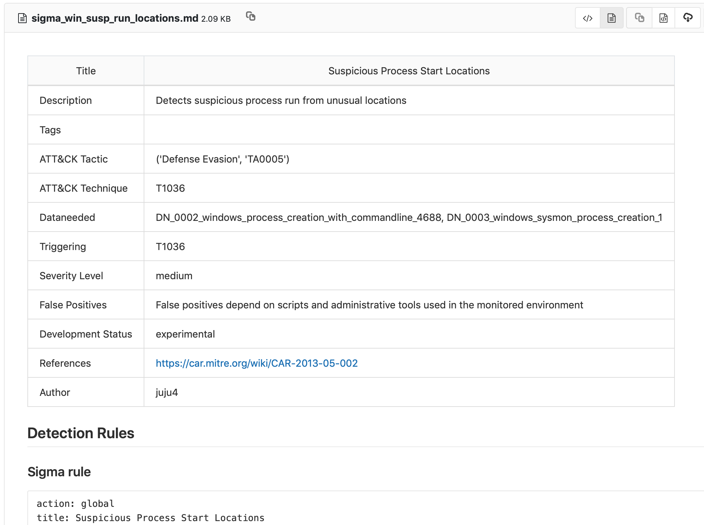
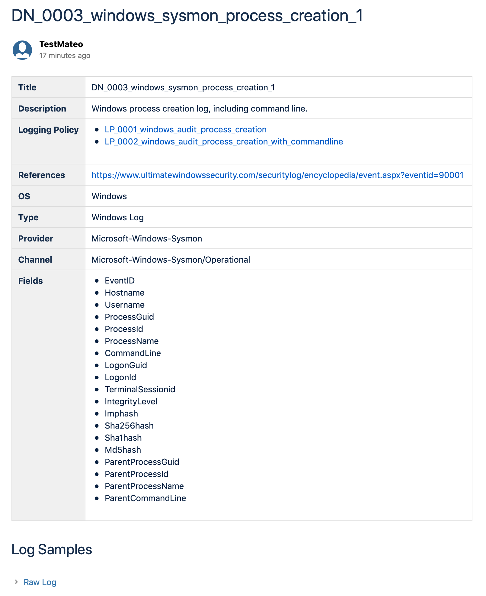
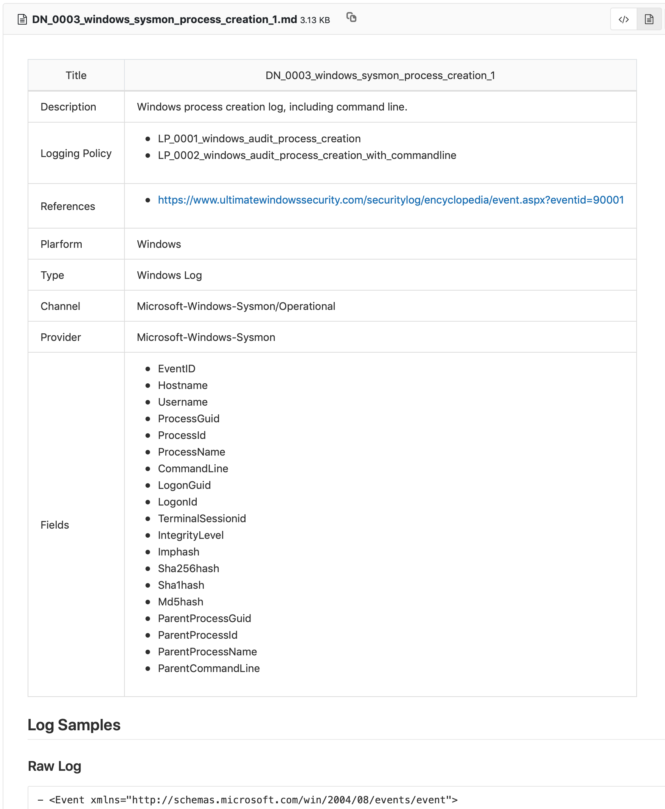
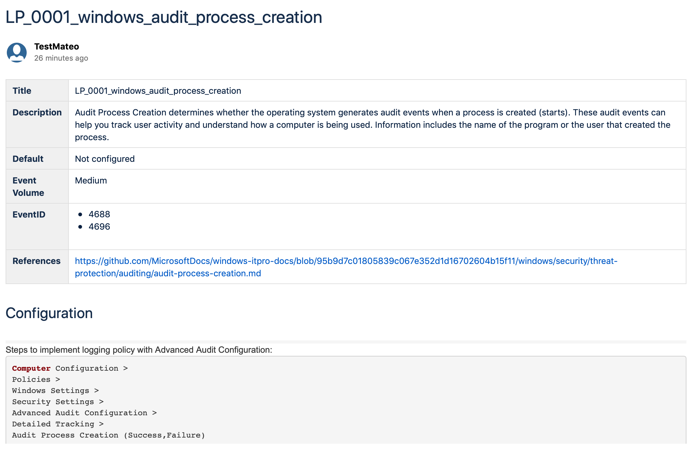
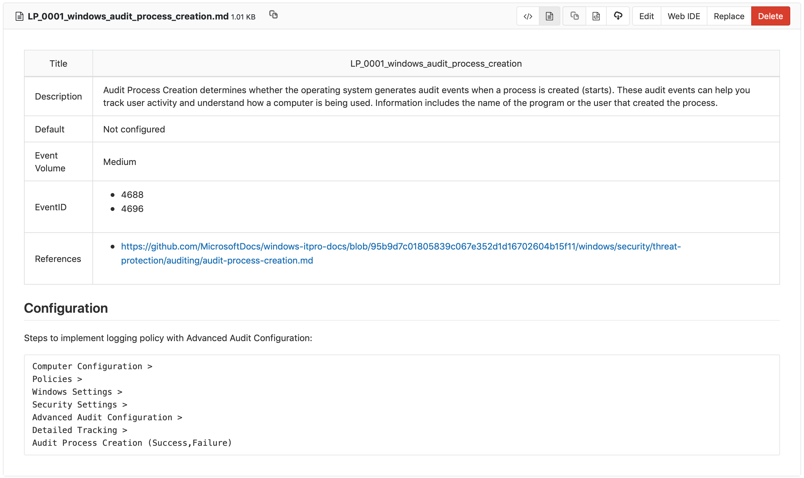
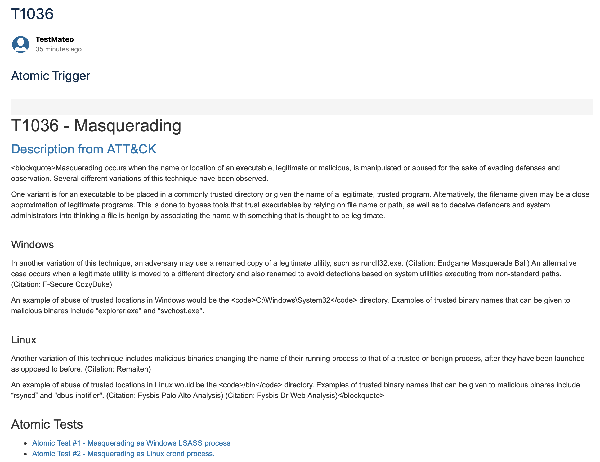
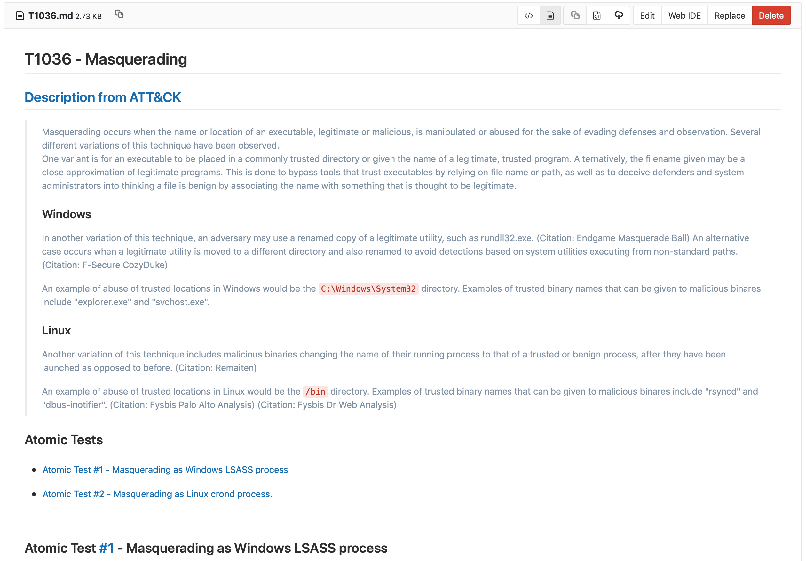

# Atomic Threat Coverage

Automatically generated knowledge base of analytics designed to cover threats based on MITRE's ATT&CK.


Atomic Threat Coverage is tool which allows you to automatically generate knowledge base of analytics, designed to cover threats (based on the [MITRE ATT&CK](https://attack.mitre.org/) adversary model) from Detection, Response, Mitigation and Simulation perspectives:

- **Detection Rules** based on [Sigma](https://github.com/Neo23x0/sigma) — Generic Signature Format for SIEM Systems
- **Data Needed** to be collected to produce detection of specific Threat
- **Logging Policies** need to be configured on data source to be able to collect Data Needed
- **Triggering** based on [Atomic Red Team](https://github.com/redcanaryco/atomic-red-team) — detection tests based on MITRE's ATT&CK
- **Response Playbooks** for reacting on Detection Rules triggered by specific Threat
- **Hardening Policies** need to be implemented to mitigate specific Threat
- **Mitigation Systems** need to be deployed and configured to mitigate specific Threat

Atomic Threat Coverage provide security teams highly automatable framework for accumulation, developing, explanation and sharing actionable analytics both internally and externally.

## Description

### Why Atomic Threat Coverage 

There are plenty <sup>[\[1\]](https://car.mitre.org)[\[2\]](https://eqllib.readthedocs.io/en/latest/)[\[3\]](https://github.com/palantir/alerting-detection-strategy-framework)[\[4\]](https://github.com/ThreatHuntingProject/ThreatHunting)</sup> of analytics/detections repositories, which you have to follow, do horrible copy/pasting job, adapt information into your own internal analytics knowledge base format, detections data model, do mappings to valuable metrics and entities etc.

How to not create yet another analytics repository? Don't!
Atomic Threat Coverage is a tool which will allow you to create and maintain **your own** analytics repository, import analytics from other projects (or from your private forks) and do export in human-readable wiki-style pages in two possible (for now) platforms:

1. [Atlassian Confluence](https://www.atlassian.com/software/confluence) pages ([here](https://atomicthreatcoverage.atlassian.net/wiki/spaces/DEMO/pages/10944874/win+susp+powershell+hidden+b64+cmd) is the demo of knowledge base automatically generated by Atomic Threat Coverage)
2. [This repo itself](Atomic_Threat_Coverage) — markdown formated wiki-style pages

In other words, you don't have to work on data representation layer manually, you work on meaningful atomic pieces of information (like Sigma rule yaml files), and Atomic Threat Coverage will create analytics database with all entities, automatically mapped to all meaningful, actionable metrics, ready to use, ready to share and show to leadership, customers and colleagues.

### How it works

Everything starts from Sigma rule and ends up with human-readable wiki-style pages. Atomic Threat Coverage parses it and:

1. Maps Detection Rule to ATT&CK Tactic using `tags` from Sigma rule
2. Maps Detection Rule to ATT&CK Technique using `tags` from Sigma rule
3. Maps Detection Rule to Data Needed using `logsource` and `detection` sections from Sigma rule
4. Maps Detection Rule to Triggering (Atomic Red Team tests) using `tags` from Sigma rule
5. Maps Logging Policies to Data Needed using existing mapping inside Data Needed
6. Converts everything into Confluence and Markdown wiki-style pages using jinja templates (`scripts/templates`)
7. Pushes all pages to local repo and Confluence server (according to configuration provided in `scripts/config.py`)

### Under the hood

Here is simplified description of the stuff inside:

```
├── analytics.csv
├── dataneeded
│   ├── DN_0001_windows_process_creation_4688.yml
│   ├── DN_0002_windows_process_creation_with_commandline_4688.yml
│   ├── DN_0003_windows_sysmon_process_creation_1.yml
│   ├── DN_0004_windows_account_logon_4624.yml
│   └── dataneeded_template.yml
├── detectionrules
│   └── sigma
├── loggingpolicies
│   ├── LP_0001_windows_audit_process_creation.yml
│   ├── LP_0002_windows_audit_process_creation_with_commandline.yml
│   ├── LP_0003_windows_sysmon_process_creation.yml
│   ├── LP_0004_windows_audit_logon.yml
│   └── loggingpolicy_template.yml
├── triggering
│   └── atomic-red-team
└── scripts
```

#### Detection Rules

Detection Rules are unmodified [Sigma rules](https://github.com/Neo23x0/sigma/tree/master/rules), so by default Atomic Threat Coverage uses rules from official repo but you can put there rules from your own local fork.  

<details>
  <summary>Detection Rule yaml (click to expand)</summary>
  
</details>

<details>
  <summary>Automatically created confluence page (click to expand)</summary>
  
</details>

<details>
  <summary>Automatically created markdown (GitLab) page (click to expand)</summary>
  
</details>

<br>
All queries automatically generated and all mappings added.

#### Data Needed

<details>
  <summary>Data Needed yaml (click to expand)</summary>
  
</details>

<details>
  <summary>Automatically created confluence page (click to expand)</summary>
  
</details>

<details>
  <summary>Automatically created markdown (GitLab) page (click to expand)</summary>
  
</details>

<br>
This entity expected to explain SIEM/LM/Data Engineering teams what kind of data they could expect to receive/collect (sample). Detailed description of data type (platform/type/channel) needed for proper calculation of mappings with Detection Rules and general description. List of fields also needed for calculation of mappings and for list in analytics, so in case of triage/incident response (identification stage) analytics could easily define where they could find some specific data type (like domain name, username, hash etc).

#### Logging Policies

<details>
  <summary>Logging Policy yaml (click to expand)</summary>
  
</details>

<details>
  <summary>Automatically created confluence page (click to expand)</summary>
  
</details>

<details>
  <summary>Automatically created markdown (GitLab) page (click to expand)</summary>
  
</details>

<br>
This entity expected to explain SIEM/LM/Data Engineering teams and IT departments which logging policies have to be configured to have proper Data Needed to have some specific Detection of specific Threat. It also explains how exactly this policy can be configured.

#### Triggers

Triggers are unmodified [Atomic Red Team tests](https://github.com/redcanaryco/atomic-red-team/tree/master/atomics), so by default Atomic Threat Coverage uses atomics from official repo but you can put there atomics from your own local fork.

<details>
  <summary>Triggers yaml (click to expand)</summary>
  
</details>

<details>
  <summary>Automatically created confluence page (click to expand)</summary>
  
</details>

<details>
  <summary>Automatically created (by Atomic Red Team) markdown (GitLab) page (click to expand)</summary>
  
</details>

<br>

This entity needed to test specific technical controls and detections. Detailed description could be found in official [site](https://atomicredteam.io).

#### Analytics.csv

Atomic Threat Coverage generates [analytics.csv](analytics.csv) with list of all data mapped to each other for filtering and simple analytics. This file is suppose to answer these questions:

- What data do I need to collect to detect specific threats?
- Which Logging Policies do I need to implement to collect the data I need for detection of specific threats?
- Which Logging Policies I can install everywhere (event volume low/medium) and which only on critical hosts (high/extremely high)?
- Which data provided me most of the high fidelity alerts? (prioritisation of data collection implementation)
- etc

Ideally, this kind of mapping could provide organizations with the ability to connect Threat Coverage from detection perspective to *money*. Like:

- if we will collect all Data Needed from all hosts for all Detection Rules we have it would be X Events Per Second (EPS) (do calculation for a couple of weeks or so) with these resources for storage/processing (some more or less concrete number)
- if we will collect Data Needed only for high fidelity alerts and only on critical hosts, it will be Y EPS with these resources for storage/processing (again, more or less concrete number)
- etc

## Goals

1. Stimulate community to use Sigma rule format (so we will have more contributors, more and better converters)
2. Stimulate community to use Atomic Red Team tests format (so we will have more contributors and execution frameworks)
3. Evangelize threat information sharing
4. Automate most of manual work
5. Provide information security community framework which will improve communication with other departments, general analytics accumulation, developing, and sharing workflow

## Workflow

1. Add your own custom [Sigma](https://github.com/Neo23x0/sigma) rules (if you have any) to `detectionrules` directory
2. Add directory with your own, custom [Atomic Red Team](https://github.com/redcanaryco/atomic-red-team) detection tests (if you have any) to `triggering` directory
3. Add Data Needed entities related to Sigma rules into `dataneeded` directory (you can create new using `dataneeded/dataneeded_template.yml`)
4. Add Logging Policies related to Data Needed into `loggingpolicies` directory (you can create new using `loggingpolicies/loggingpolicy_template.yml`)
5. Configure your export settings using `scripts/config.py`
6. Execute `make` in root directory of the repository

## Current Status: Proof Of Concept

The project is currently in Proof Of Concept stage and it was developed in a few evenings. It doesn't work for all Sigma rules. We will rewrite most of scripts in a proper way, cover all original [Sigma](https://github.com/Neo23x0/sigma) rules and add other entities (like Playbooks). We want to show working example of data processing to discuss it with the community, receive feedback and suggestions.

## Requirements

- Unix-like OS or [Windows Subsystem for Linux (WSL)](https://en.wikipedia.org/wiki/Windows_Subsystem_for_Linux) (it required to execute `make`)
- Python 3.7.1
- [jinja2](https://pypi.org/project/Jinja2/) python library
- [Render Markdown](https://marketplace.atlassian.com/apps/1212654/render-markdown) app for Confluence (free open source)

## Authors

- Daniil Yugoslavskiy, [@yugoslavskiy](https://github.com/yugoslavskiy)
- Jakob Weinzettl, [@mrblacyk](https://github.com/mrblacyk)
- Mateusz Wydra, [@sn0w0tter](https://github.com/sn0w0tter)
- Mikhail Aksenov, [@AverageS](https://github.com/AverageS)

## TODO

- [ ] Fix `analytics.csv` generation
- [ ] Develop Polish and Russian version of the README
- [ ] Rewrite `make` and all bash scripts in python for compatibility with Windows
- [ ] Rewrite main codebase in a proper way
- [ ] Add contribution description
- [ ] Create developer guide (how to create custom fields)
- [ ] Implement consistent Data Model (fields naming)
- [ ] Add the rest of Data Needed for default Sigma rules
- [ ] Add the rest of Logging Policies for all Data Needed
- [ ] Define new Detection Rule naming scheme (separate Events and Alerts)
- [ ] Develop docker container for the tool
- [ ] Create [MITRE ATT&CK Navigator](https://mitre.github.io/attack-navigator/enterprise/) profile generator per data type
- [ ] Create new entity called "Enrichments" which will define how to enrich specific Data Needed
- [ ] Implement new entity — "Visualisation" with Kibana visualisations/dashboards stored in yaml files and option to convert them into curl commands for uploading them into Elasticsearch
- [ ] Implement "Playbook" entity (based on Detection Rule and Data Needed) with automatic TheHive Case Templates generation (actionable Playbook)

## Links

[\[1\]](https://car.mitre.org) MITRE Cyber Analytics Repository  
[\[2\]](https://eqllib.readthedocs.io/en/latest/) Endgame EQL Analytics Library  
[\[3\]](https://github.com/palantir/alerting-detection-strategy-framework) Palantir Alerting and Detection Strategy Framework  
[\[4\]](https://github.com/ThreatHuntingProject/ThreatHunting) The ThreatHunting Project  

## License

See the [LICENSE](LICENSE) file.
