🇬🇧 [English version](README.md)  |   🇵🇱 [Polska wersja](README_PL.md)  

# Atomic Threat Coverage

Автоматически генерируемая действенная аналитика, предназначенная для противодействия угрозам, описанным в MITRE [ATT&CK](https://attack.mitre.org/).


Atomic Threat Coverage это утилита которая позволяет автоматически сгенерировать действенную аналитику, предназначенную для противодействия угрозам, описанным в [MITRE ATT&CK](https://attack.mitre.org/) с позиций Обнаружения, Реагирования, Предотвращения и Имитации угроз:

- **Detection Rules** — Правила Обнаружения основанные на [Sigma](https://github.com/Neo23x0/sigma) — общем формате описания правил корреляции для SIEM систем
- **Data Needed** — данные, которые необходимо собирать для обнаружения конкретной угрозы
- **Logging Policies** — настройки логирования, которые необходимо произвести на устройстве для сбора данных, необходимых для обнаружения конкретной угрозы
- **Enrichments** — настройки обогащения данных (Data Needed) необходимые для реализации некоторых Правил Обнаружения (Detection Rules)
- **Triggers** — сценарии имитации атак основанные на [Atomic Red Team](https://github.com/redcanaryco/atomic-red-team) — атомарных тестах/сценариях реализации угроз из MITRE ATT&CK
- **Response Actions** — атомарные шаги реагирования на инциденты
- **Response Playbooks** — сценарии реагирования на инциденты, сгенерированные в ходе обнаружения конкретной угрозы, составленные на основе Response Actions
- **Visualisations** - визуализации для создания дашборд Threat Hunting / Triage
- **Hardening Policies** — настройки систем, которые позволяют нивелировать конкретную угрозу
- **Mitigation Systems** — системы и технологии, которые позволяют нивелировать конкретную угрозу
- **Customers** — заказчики аналитики, которые могут быть как внешними, так и внутренними. Эта сущность необходима для отслеживания статусов реализации

Atomic Threat Coverage является автоматизированным фреймворком для сохранения, разработки, анализа и распространения практической, действенной аналитики.

## Описание

### Предпосылки

Существует много достойных проектов, которые реализуют функциональность (или предоставляют аналитику) конкретной направленности ([Sigma](https://github.com/Neo23x0/sigma) — Обнаружение, [Atomic Red Team](https://github.com/redcanaryco/atomic-red-team) — Имитация угроз). Их объединяет один недостаток — они существуют в вакууме своей области. В реальности же все очень тесно взаимосвязанно — данные для обнаружения угроз не берутся из ниоткуда, и генерируемые Алерты не уходят в никуда. Сбор данных, администрирование систем защиты, обнаружение угроз или реагирование на них — это составная часть большого и сложного процесса, требующего плотного взаимодействия нескольких подразделений.

Проблемы одной функции зачастую проще, дешевле и эффективнее решать методами другой. Многие задачи не решаются в рамках одной функции. Каждая из функций базируется на возможностях и качестве другой. Не получится эффективно детектировать угрозы и реагировать на инциденты без сбора и обогащения необходимых данных. Не получится эффективно реагировать на инциденты без понимания того, какими средствами/системами/технологиями можно блокировать угрозу. Крайне неэффективно проводить тестирование на проникновение или Red Team exercises без представления о возможностях процессов, персонала и систем по блокированию, обнаружению и реагированию на инциденты. Все это требует тесного взаимодействия и взаимопонимания между подразделениями.

На практике наблюдается сложность во взаимодействии, обусловленная следующими факторами:

- Отсутствие общей модели/классификации угроз, общей терминологии
- Отсутствие понимания общих целей
- Отсутствие простого метода выражения своих потребностей
- Разница в компетенциях (как в плане глубины, так и в плане различия предметных областей)

Именно поэтому мы решили разработать Atomic Threat Coverage — проект, который призван связать разные функции под единой "Threat Centric" методологией ([Lockheed Martin Intelligence Driven Defense®](https://www.lockheedmartin.com/en-us/capabilities/cyber/intelligence-driven-defense.html) aka [MITRE Threat-based Security](https://mitre.github.io/unfetter/about/)), моделью угроз ([MITRE ATT&CK](https://attack.mitre.org/)) и предоставить подразделениям информационной безопасности эффективный инструмент для совместной работы над одной задачей — противодействию угрозам.

### Почему Atomic Threat Coverage

Работа с существующими <sup>[\[1\]](https://car.mitre.org)[\[2\]](https://eqllib.readthedocs.io/en/latest/)[\[3\]](https://github.com/palantir/alerting-detection-strategy-framework)[\[4\]](https://github.com/ThreatHuntingProject/ThreatHunting)</sup> репозиторями аналитики выглядит как бесконечное кликание CTRL+C/CTRL+V, ручная адаптация информации под собственные нужды, модель данных, сопоставление с внутренними метриками и так далее. 

Мы решили пойти иным путем. 

Atomic Threat Coverage это фреймворк для создания **вашей собственной** базы знаний, импорта аналитики из других проектов (таких как [Sigma](https://github.com/Neo23x0/sigma), [Atomic Red Team](https://github.com/redcanaryco/atomic-red-team), а также **ваших** приватных форков этих проектов с **вашей** аналитикой) и экспорта этой аналитики в удобные для восприятия человеком статьи в две (на текущий момент) платформы:

1. [Atlassian Confluence](https://www.atlassian.com/software/confluence) ([здесь](https://atomicthreatcoverage.atlassian.net/wiki/spaces/ATC/pages/126025996/WMI+Persistence+-+Script+Event+Consumer) можно посмотреть автоматически сгенерированную базу знаний)
2. [В текущий репозиторий](Atomic_Threat_Coverage) — автоматически сгенерированные статьи в вики-формате на языке Markdown

Другими словами, вам не нужно работать с уровнем представления данных вручную, вы работаете только с осмысленными атомарными кусочками информации (такими как Sigma правила), и Atomic Threat Coverage автоматически создаст базу аналитики со всеми сущностями, связанными со всеми важными, действенными метриками, готовую к использованию, распространению, презентации руководству, заказчикам и коллегам.

### Как это работает

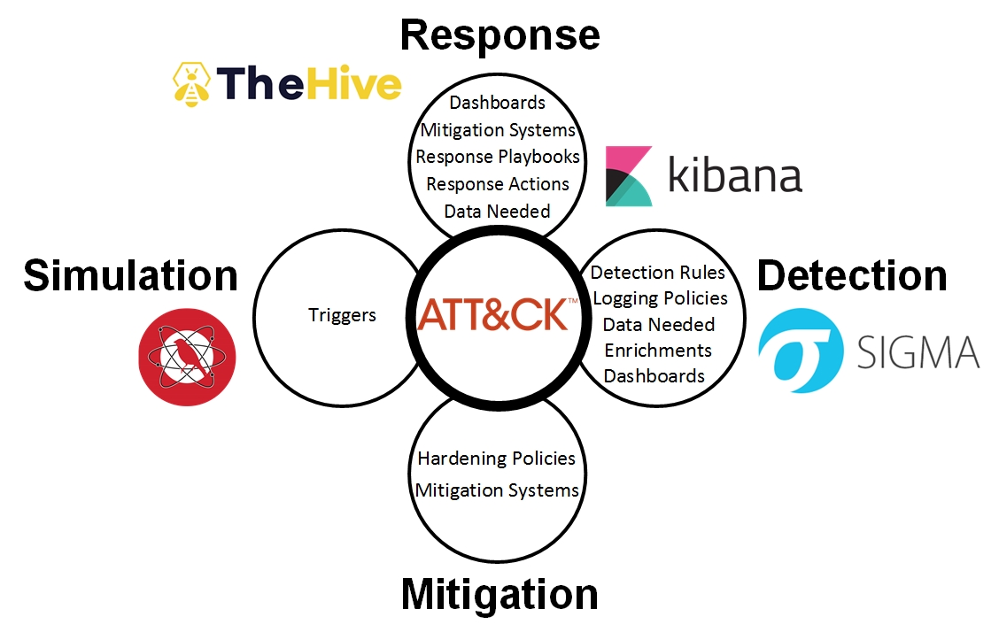

Все начинается с Sigma правила и заканчивается удобными для восприятия человеком статьями и иной действенной аналитикой. Atomic Threat Coverage парсит Sigma правило, после чего:

1. Привязывает Detection Rules к тактикам и техникам ATT&CK, используя `tags` Sigma правила
2. Привязывает Detection Rules к Data Needed, используя `logsource` и `detection` Sigma правила
3. Привязывает Detection Rules к Triggers, (Atomic Red Team тест), используя `tags` Sigma правила
4. Привязывает Detection Rules к Enrichments используя существующие в Detection Rule ссылки
5. Привязывает Response Playbooks к тактикам и техникам ATT&CK, используя существующие в Response Playbooks ссылки
6. Привязывает Response Actions к Response Playbooks используя существующие в Response Playbooks ссылки
7. Привязывает Logging Policies к Data Needed используя существующие в Data Needed ссылки
8. Привязывает Detection Rules, Data Needed и Logging Policies к Customers используя ссылки внутри объекта Customer
9. Конвертирует все в Confluence и Markdown вики-подобные статьи используя шаблоны jinja (`scripts/templates`)
10. Создает статьи в локальном репозитории и в Confluence (согласно конфигурации в `scripts/config.yml`)
11. Создает индекс в [Elasticsearch](https://www.elastic.co/products/elasticsearch) для визуализации и анализа существующих данных в [Kibana](https://www.elastic.co/products/kibana) 
12. Создает профили [ATT&CK Navigator](https://mitre-attack.github.io/attack-navigator/enterprise/) с визуализацией текущих возможностей детектирования угроз для каждого отдельного клиента (и один общий по всем существующим данным)
13. Создает TheHive Case Templates на основе Response Playbooks
14. Создает `analytics.csv` и `pivoting.csv` файлы для простого анализа существующих данных
15. Создает json файлы дашбордов для [Kibana](https://www.elastic.co/products/kibana) 

### Под капотом

Типы аналитических данных в репозитории:

```
├── analytics/
│   ├── generated/
│   │   ├── analytics.csv
│   │   ├── pivoting.csv
│   │   ├── atc_es_index.json
│   │   ├── thehive_templates/
│   │   │   └── RP_0001_phishing_email.json
│   │   └── attack_navigator_profiles/
│   │   │   ├── atc_attack_navigator_profile.json
│   │   │   ├── atc_attack_navigator_profile_CU_0001_TESTCUSTOMER.json
│   │   │   └── atc_attack_navigator_profile_CU_0002_TESTCUSTOMER2.json
│   │   └── visualizations/
│   │   │   └── os_hunting_dashboard.json
│   └── predefined/
│   │   ├── atc-analytics-dashboard.json
│   │   ├── atc-analytics-index-pattern.json
│   │   └── atc-analytics-index-template.json
├── customers/
│   ├── CU_0001_TESTCUSTOMER.yml
│   ├── CU_0002_TESTCUSTOMER2.yml
│   └── customer.yml.template
├── data_needed/
│   ├── DN_0001_4688_windows_process_creation.yml
│   ├── DN_0002_4688_windows_process_creation_with_commandline.yml
│   └── dataneeded.yml.template
├── detection_rules/
│   └── sigma/
├── enrichments/
│   ├── EN_0001_cache_sysmon_event_id_1_info.yml
│   ├── EN_0002_enrich_sysmon_event_id_1_with_parent_info.yaml
│   └── enrichment.yml.template
├── logging_policies/
│   ├── LP_0001_windows_audit_process_creation.yml
│   ├── LP_0002_windows_audit_process_creation_with_commandline.yml
│   └── loggingpolicy_template.yml
├── response_actions/
│   ├── RA_0001_identification_get_original_email.yml
│   ├── RA_0002_identification_extract_observables_from_email.yml
│   └── respose_action.yml.template
├── response_playbooks/
│   ├── RP_0001_phishing_email.yml
│   ├── RP_0002_generic_response_playbook_for_postexploitation_activities.yml
│   └── respose_playbook.yml.template
├── triggering/
│   └── atomic-red-team/
└── visualizations/
    ├── dashboards/
    │   ├── examples/
    │   │   └── test_dashboard_document.yml
    │   └── os_hunting_dashboard.yml
    └── visualizations/
        ├── examples/
        │   └── vert_bar.yml
        └── wmi_activity.yml
```

#### Detection Rules

Detection Rules — Правила Обнаружения — оригинальные, не модифицированные [Sigma правила](https://github.com/Neo23x0/sigma/tree/master/rules). По умолчанию Atomic Threat Coverage использует правила из официального репозитория, но вы можете (*вам следует*) использовать ваши собственные Sigma правила из приватного форка, с внутренней аналитикой, релевантной для вас.

<details>
  <summary>Detection Rule yaml (кликните чтобы раскрыть)</summary>
  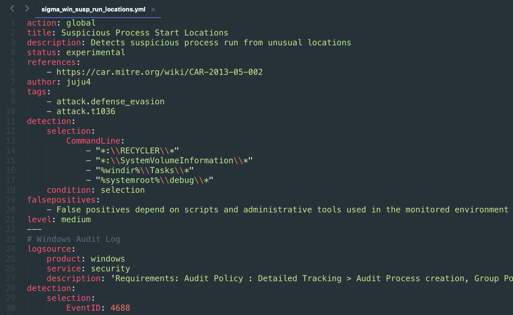
</details>

<details>
  <summary>Автоматически сгенерированная страница в Confluence (кликните чтобы раскрыть)</summary>
  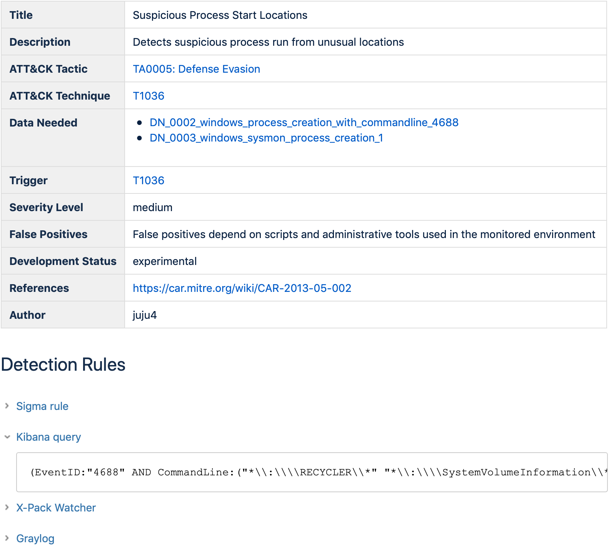
</details>

<details>
  <summary>Автоматически сгенерированная страница в Markdown (кликните чтобы раскрыть)</summary>
  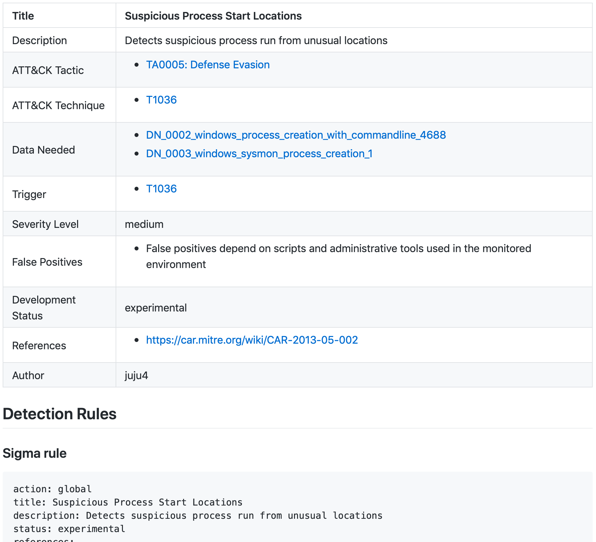
</details>

<br>

Ссылка на Data Needed, Trigger, и статьи в ATT&CK сгенерированы автоматически.  
Sigma правило, запросы для Kibana, X-Pack Watcher и запрос GrayLog сгенерированы и добавлены автоматически (этот список может быть расширен и зависит от поддерживаемых Sigma [платформах для экспорта правил](https://github.com/Neo23x0/sigma#supported-targets)).

#### Data Needed

<details>
  <summary>Data Needed yaml (кликните чтобы раскрыть)</summary>
  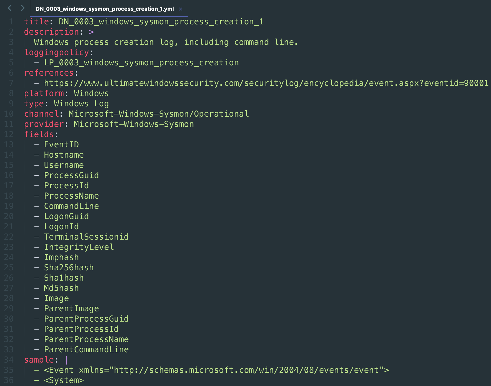
</details>

<details>
  <summary>Автоматически сгенерированная страница в Confluence (кликните чтобы раскрыть)</summary>
  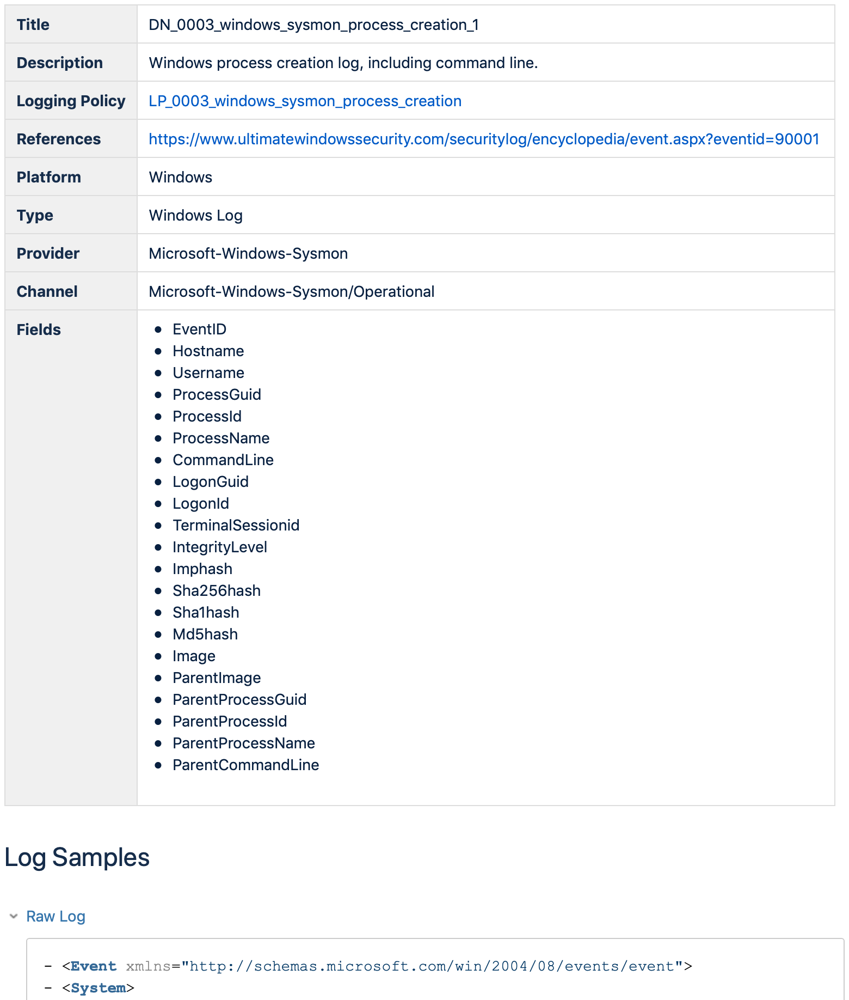
</details>

<details>
  <summary>Автоматически сгенерированная страница в Markdown (кликните чтобы раскрыть)</summary>
  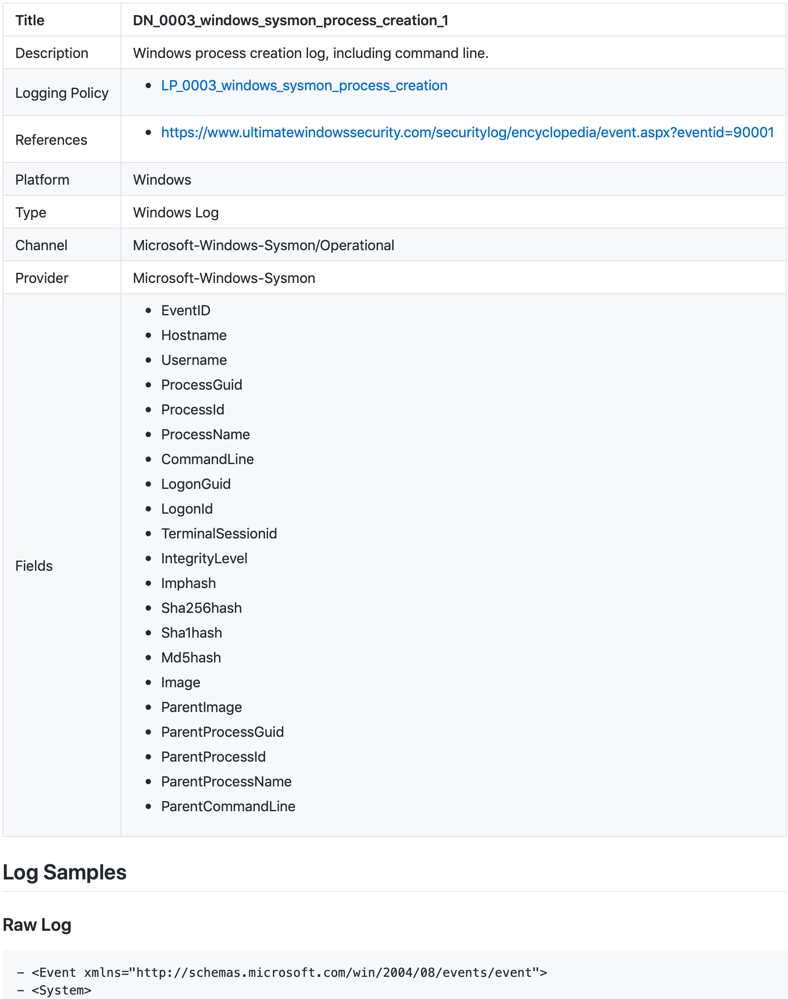
</details>

<br>

Эта сущность в первую очередь призвана упростить коммуникацию с SIEM/LM/Data Engineering подразделениями.
Она включает в себя следующие данные:

- Детальное описание данных (Platform/Type/Channel/etc) необходимо для вычисления связи с Правилами Обнаружения (Detection Rules)
- Sample — пример лога, описание того как выглядят оригинальные данные, которые необходимо собирать для Обнаружения конкретных угроз и Реагирования на инциденты
- Лист доступных полей необходим для вычисления связи с Правилами Обнаружения (Detection Rules), для генерации сценариев реагирования на инциденты (Response Playbooks), а также для генерации `pivoting.csv`

#### Logging Policies

<details>
  <summary>Logging Policy yaml (кликните чтобы раскрыть)</summary>
  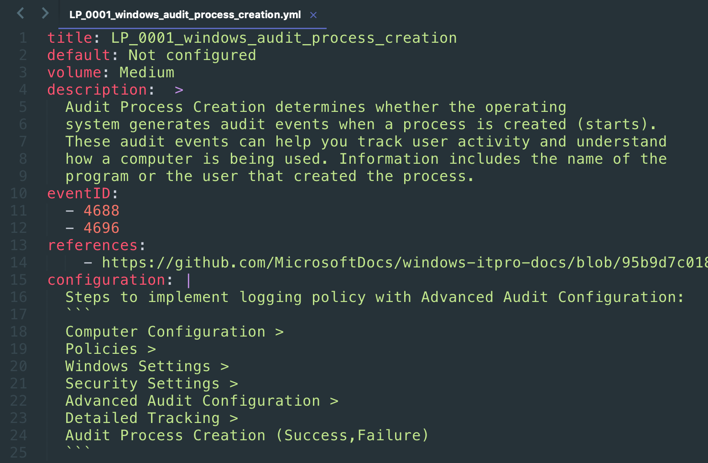
</details>

<details>
  <summary>Автоматически сгенерированная страница в Confluence (кликните чтобы раскрыть)</summary>
  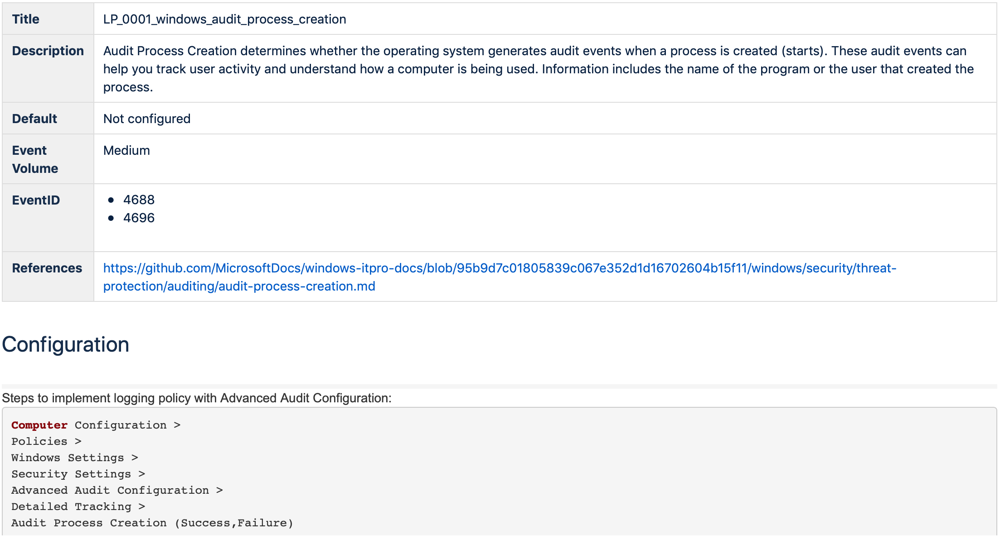
</details>

<details>
  <summary>Автоматически сгенерированная страница в Markdown (кликните чтобы раскрыть)</summary>
  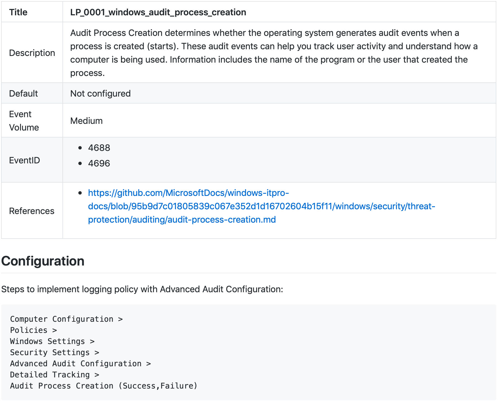
</details>

<br>

Эта сущность призвана упростить коммуникацию с SIEM/LM/Data Engineering подразделениями.
Она включает в себя описание конфигурации, которую необходимо реализовать на источнике данных, чтобы собирать данные (Data Needed), необходимые для Обнаружения конкретных угроз и Реагирования на инциденты.

#### Enrichments

<details>
  <summary>Enrichments yaml (кликните чтобы раскрыть)</summary>
  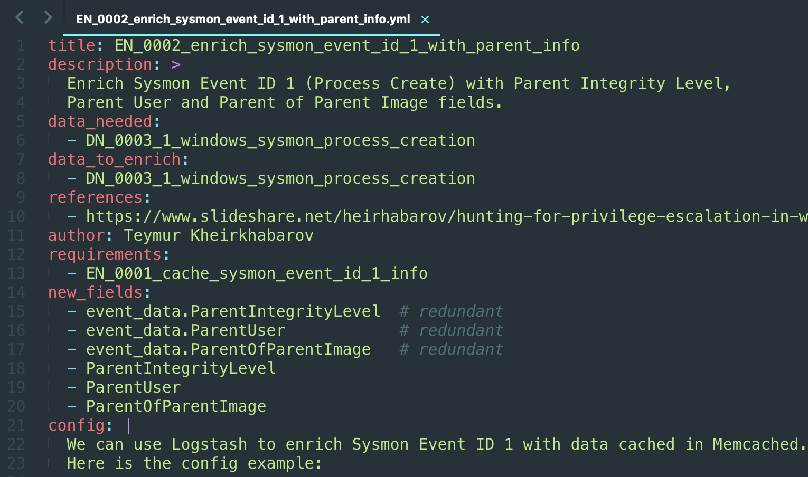
</details>

<details>
  <summary>Автоматически сгенерированная страница в Confluence (кликните чтобы раскрыть)</summary>
  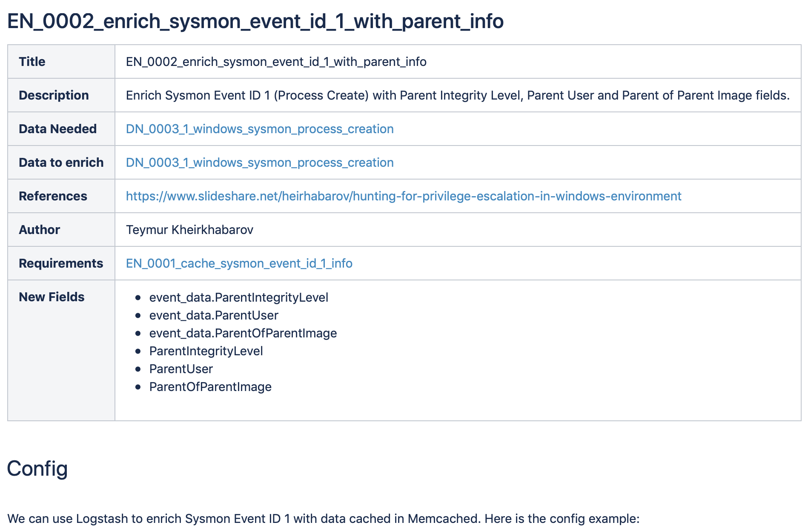
</details>

<details>
  <summary>Автоматически сгенерированная страница в Markdown (кликните чтобы раскрыть)</summary>
  
</details>

<br>

Эта сущность призвана упростить коммуникацию с SIEM/LM/Data Engineering подразделениями.
Она включает в себя:

- Список данных (Data Needed), которые могут быть обогащены
- Описание целей обогащения — новое поле, переименование, новые данные в конкретном поле и так далее
- Пример реализации описываемого обогащения данных (например, с использованием Logstash)

Таким образом можно будет просто и на конкретных примерах объяснить почему вам необходимо какое-то конкретное обогащение данных (посредством связи с Правилами Обнаружения) или какая-то конкретная система для обогащения данных (например, Logstash).

#### Triggers

Triggers — сценарии имитации атак — оригинальные, не модифицированные [Atomic Red Team тесты](https://github.com/redcanaryco/atomic-red-team/tree/master/atomics). По умолчанию Atomic Threat Coverage использует тесты из официального репозитория, но вы можете (*вам следует*) использовать ваши собственные Atomic Red Team тесты из приватного форка, с внутренней аналитикой, релевантной для вас.

<details>
  <summary>Trigger yaml (кликните чтобы раскрыть)</summary>
  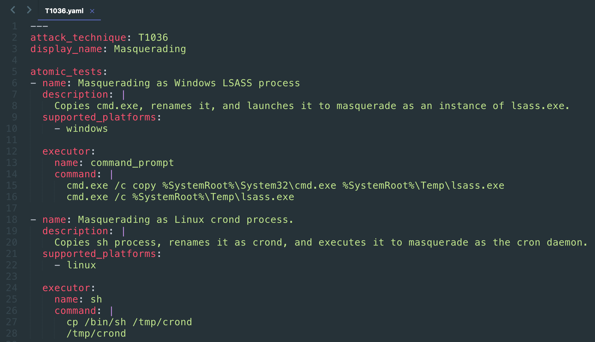
</details>

<details>
  <summary>Автоматически сгенерированная страница в Confluence (кликните чтобы раскрыть)</summary>
  
</details>

<details>
  <summary>Автоматически сгенерированная страница в Markdown (кликните чтобы раскрыть)</summary>
  
</details>

<br>

Эта сущность позволяет тестировать возможности по обнаружению конкретных угроз, а также систем/механизмов/технологий обеспечения безопасности. Полное описание можно посмотреть на официальном [сайте](https://atomicredteam.io).


#### Customers

<details>
  <summary>Customers yaml (кликните чтобы раскрыть)</summary>
  
</details>

<details>
  <summary>Автоматически сгенерированная страница в Confluence (кликните чтобы раскрыть))</summary>
  
</details>

<details>
  <summary>Автоматически сгенерированная страница в Markdown (кликните чтобы раскрыть))</summary>
  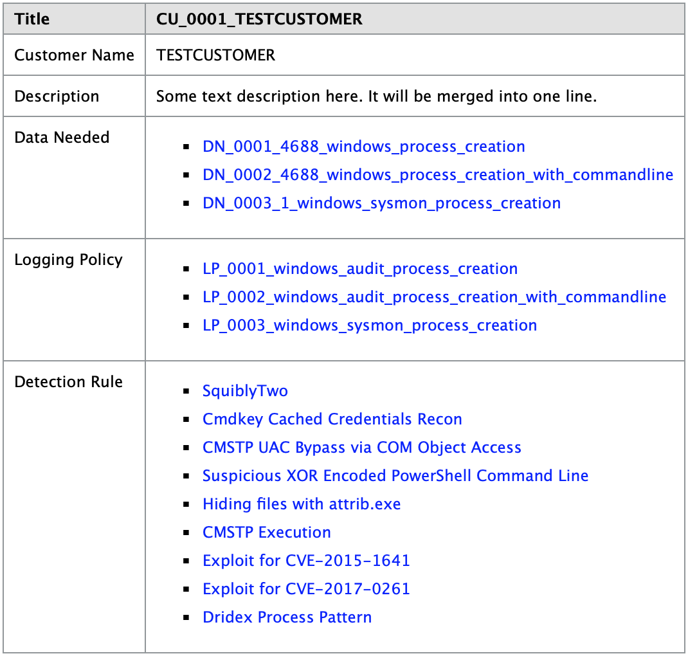
</details>

<br>

Эта сущность позволяет отслеживать какие Logging Policicies настроены, какие данные DataNeeded собираются и какие  Detection Rule имплементированы для клиента. Клиент может быть как внутренним ( например удаленный сайт ) так и внешним ( в случае предоставления услуг ). Никаких ограничений на эту сущность нет - это может быть даже конкретный хост. 

Эта сущность призвана упростить коммуникацию между отделами SIEM/LM/Data Engineering и сделать прозрачной текущую реализацию для руководства. Сущность используются при генерации 
`analytics.csv`,`atc_attack_navigator_profile.json` (per customer) и `atc_es_index.json`.

#### Response Actions

<details>
  <summary>Response Action yaml (кликните чтобы раскрыть)</summary>
  
</details>

<details>
  <summary>Автоматически сгенерированная страница в Confluence (кликните чтобы раскрыть)</summary>
  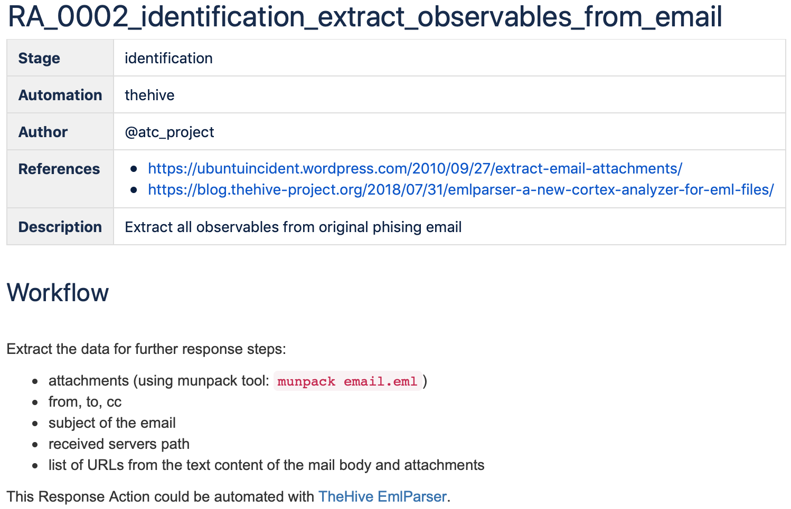
</details>

<details>
  <summary>Автоматически сгенерированная страница в Markdown (кликните чтобы раскрыть)</summary>
  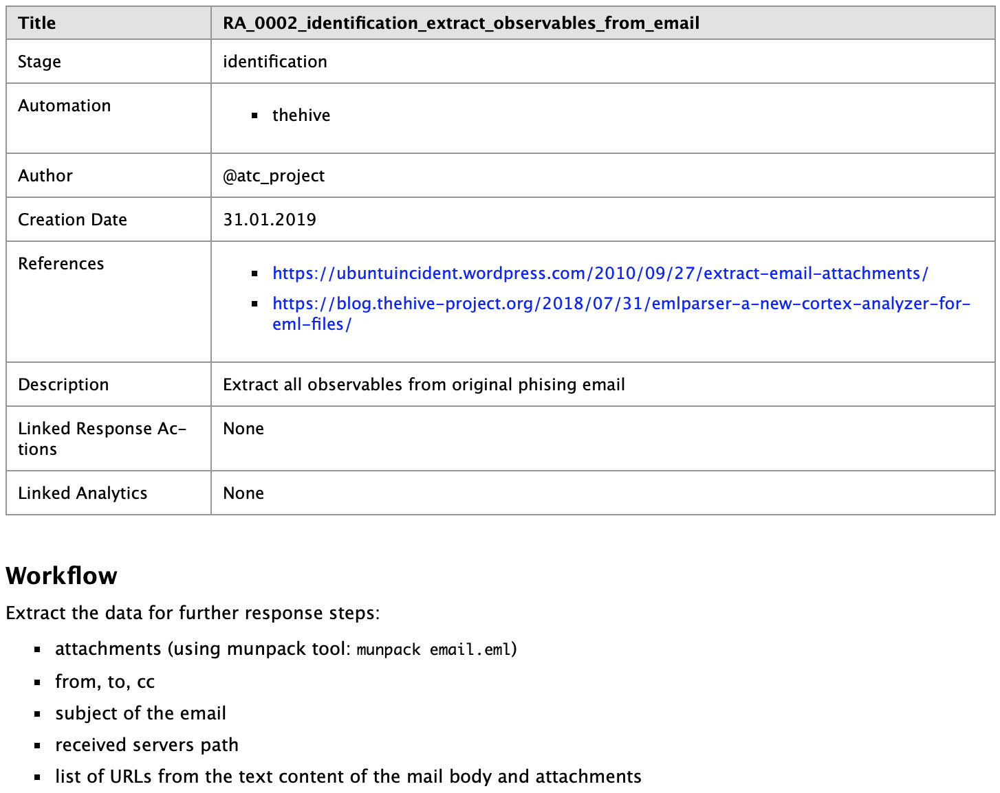
</details>

<br>

Эта сущность используется для составления Response Playbooks — планов реагирования на инциденты.

#### Response Playbooks

<details>
  <summary>Response Playbook yaml (кликните чтобы раскрыть)</summary>
  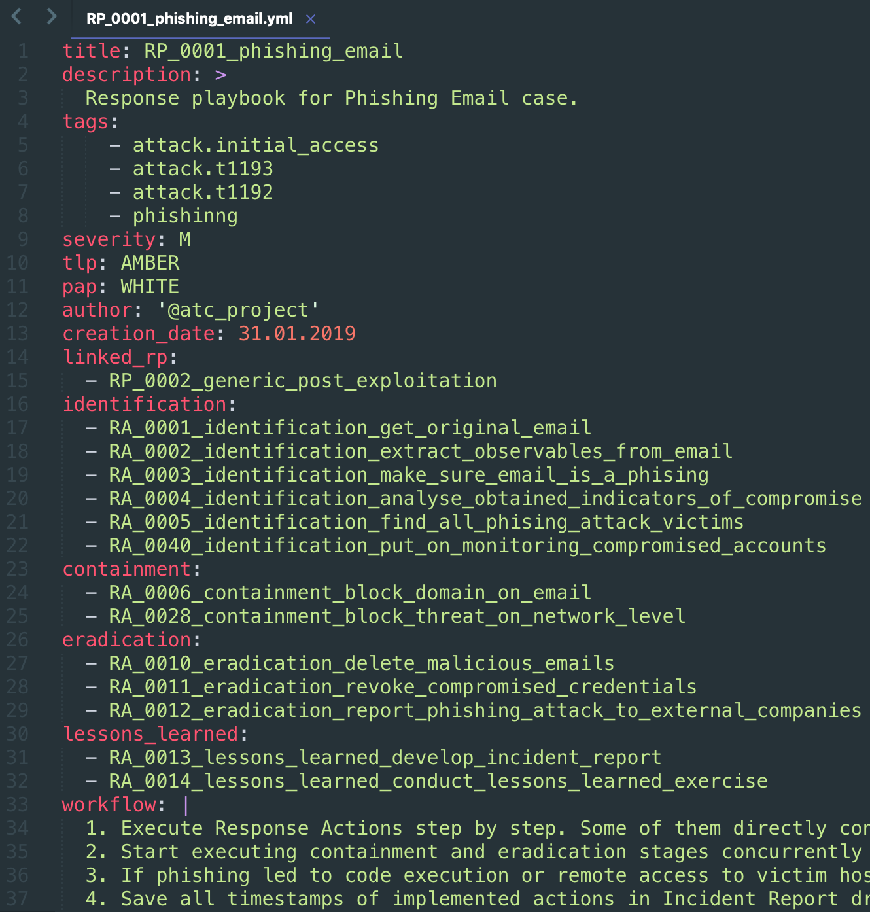
</details>

<details>
  <summary>Автоматически сгенерированная страница в Confluence (кликните чтобы раскрыть)</summary>
  
</details>

<details>
  <summary>Автоматически сгенерированная страница в Markdown (кликните чтобы раскрыть)</summary>
  
</details>

<br>

Эта сущность используется играет роль плана реагирования на инциденты и служит основной для TheHive Case Templates.

#### TheHive Case Templates

Atomic Threat Coverage создает [TheHive Case Templates](analytics/generated/thehive_templates/) построенные с помощью [Response Playbooks](#response-playbooks). Каждый таск в шаблоне кейса является [Response Action](#response-actions), связанным с конкретным шагом в  IR Lifecycle (по описанию в Response Playbook).

<details>
  <summary> Response Playbook, экспортированный в шаблон кейса TheHive  (кликните чтобы раскрыть)</summary>
  
</details>

<details>
  <summary>Response Action, экспортированный в таск TheHive (кликните чтобы раскрыть)</summary>
  
</details>

#### Visualizations

<details>
  <summary>Visualization yaml (кликните чтобы раскрыть)</summary>
  
</details>

<details>
  <summary>Dashboard yaml (кликните чтобы раскрыть)</summary>
  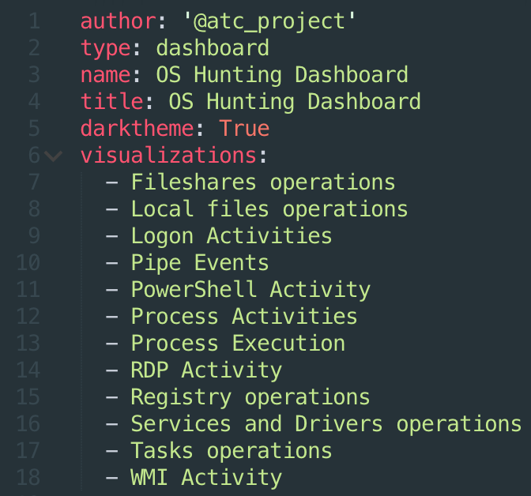
</details>

<details>
  <summary>Дашборд в Kibana (кликните чтобы раскрыть)</summary>
  
</details>

<br>

Визуализации включают в себя другие визуализации, Saved Searches и Дашборды, созданные с их помощью. Проще говоря, визуализации представляют собой строительные блоки, из которых можно построить дашборды для разных целей.

На данный момент мы экспортируем только в Kibana, но мы планируем сделать экспорт в другие платформы (в ближайшее время Splunk является нашим приоритетом).
Эта сущность может быть описана как Sigma для визуализаций.

Подробная инструкция о том, как ими пользоваться может быть найдена [здесь](scripts/atc_visualizations/README.md).

#### atc_es_index.json

Atomic Threat Coverage создает [Elasticsearch](https://www.elastic.co/products/elasticsearch) [индекс](analytics/generated/atc_es_index.json)
Со всеми данными и связями для визуализации и аналитики в [Kibana](https://www.elastic.co/products/kibana).
Демо аналитической дашборды ATC построенной на публичных sigma-правилах доступно [здесь](https://kibana.atomicthreatcoverage.com) (user: demo, password: password).

<details>
  <summary>Аналитическая дашборда ATC в Kibana (кликните чтобы раскрыть)</summary>
  
</details>

<br>

Она призвана помочь ответить на следующие вопросы:

- Какие данные мне нужны чтобы детектировать те или иные угрозы?
- Какие политики логирования я должен настроить для сбора данных, которые мне нужны чтобы детектировать те или иные угрозы?
- Какие данные из тех, что у меня есть, позволяют мне реализовать наиболее критичные правила обнаружения?
- И так далее

<!-- - На какие угрозы я могу реагировать с существующими Response Playbooks? -->

В идеале, эти визуализации должны предоставить компаниям возможность связать покрытие угроз с точки зрения детектирования с *деньгами*. 
Например:

- Если мы соберем все данные со всех хостов для всех правил детектирования, это будет X событий в секунду (EPS) и нам нужно столько-то ресурсов для их обработки и хранения.
- Если мы будем собирать только данные для высокоприоритетых угроз, это будет Y событий в секунду (EPS) и нам нужно столько-то ресурсов для их обработки и хранения. 
- И так далее.

Если у Вас нет ElasticSearch и Kibana под рукой, то вы можете использовать `analytics.csv` для тех же целей.

#### atc_attack_navigator_profile.json

Atomic Threat Coverage генерирует [ATT&CK Navigator](https://mitre-attack.github.io/attack-navigator/enterprise/) [профайл](atc_attack_navigator_profile.json) для визуализации текущих возможностей по обнаружению угроз, анализа пробелов, приоритизации разработки, планирования, и так далее. Вам необходимо загрузить этот файл в публичный или (правильнее) приватный сайт ATT&CK Navigator, кликнуть New Tab -> Open Existing Layer -> Upload from local. Вот как выглядит текущий профайл, сгенерированный на основе существующих данных (оригинальные [Sigma](https://github.com/Neo23x0/sigma) правила, только Windows):

<details>
  <summary>ATT&CK Navigator профайл для оригинальных правил Sigma (кликните чтобы раскрыть)</summary>
  
</details>


#### analytics.csv

Atomic Threat Coverage генерирует [analytics.csv](analytics.csv) — список данных со всеми зависимостями для простой аналитики посредством фильтров. 

<details>
  <summary>Пример фильтра по технике "pass the hash" (кликните чтобы раскрыть)</summary>
  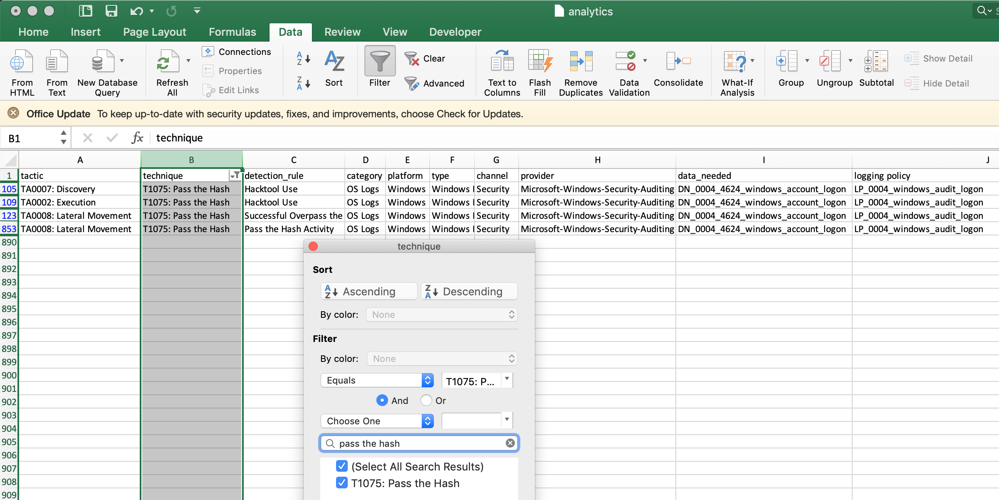
</details>

<br>

Этот файл может быть использован для тех же целей что и `atc_es_index.json`.

#### pivoting.csv

Atomic Threat Coverage генерирует [pivoting.csv](pivoting.csv) — список полей из всех данных которые необходимо собирать для обнаружения конкретной угрозы (Data Needed) с детальным описанием этих данных (категория, платформа, тип, канал, провайдер). Этот файл предназначен для поиска источников данных по конкретному типу данных. Например, в ходе реагирования на инцидент (этап Identification), необходимо выяснить какие источники данных могут предоставить domain name, username, hash и так далее:

<details>
  <summary>Пример фильтра по полю "hash" (кликните чтобы раскрыть)</summary>
  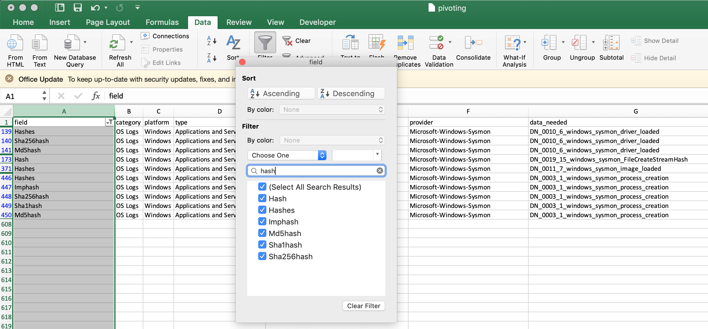
</details>

<br>

В то же время [pivoting.csv](pivoting.csv) отображает какие поля могу быть найдены только в случае использования конкретных методов обогащения:

<details>
  <summary>Пример фильтра по полю "ParentImage" (кликните чтобы раскрыть)</summary>
  
</details>


## Цели проекта

1. Стимулировать сообщество использовать MITRE ATT&CK фреймворк
2. Стимулировать сообщество использовать [Sigma](https://github.com/Neo23x0/sigma) правила и  [Atomic Red Team](https://github.com/redcanaryco/atomic-red-team) тесты (больше разработчиков, больше конвертеров правил и больше фреймворков исполнения хорошего качества)
3. Евангелизация распространения, обмена Cyber Threat Intelligence
4. Автоматизация ручной работы
5. Предоставление сообществу фреймворка для улучшения коммуникации с смежными департаментами, сохранения, разработки, анализа и распространения практической, действенной аналитики

## Алгоритм использования

### Демо контейнер Docker 

Вы можете использовать Docker для того, чтобы посмотреть, как ATC работает с данными из открытых источников. Для этого нужно выполнить следующее:

1. Клонируйте репозиторий или скачайте [архив](https://github.com/krakow2600/atomic-threat-coverage/archive/master.zip) с ним
2. Перейдите в директорию проекта
3. Скачайте и обновите репозитории Sigma и Atomic Red Team c помощью git submodules:
```bash
git submodule init
git submodule update
git submodule foreach git pull origin master
```
4. Скопируйте  `scripts/config.default.yml` в `scripts/config.yml`
5. Обновите `scripts/config.yml`, указав ссылки на ваш узел Confluence (вам помогут инструкции внутри конфигурационного файла)
6. Соберите образ с помощью `docker build . -t atc`
7. Запустите контейнер с помощью `docker run -it atc`
8. Введите логин и пароль для Confluence, когда скрипт спросит об этом

После этого Confluence будет заполнен данными и аналитикой, которая будет сгенерирована на вашей стороне (Elasticsearch индекс, csv файлы, TheHive шаблоны, MITRE ATT&CK Navigator профили и т.д.)

Мы пока не рекомендуем Docker для использования в продакшене. 

Если вы хотите только посмотреть на конечный результат, вы можете использовать онлайн [демо](https://atomicthreatcoverage.atlassian.net/wiki/spaces/ATC/pages/126025996/WMI+Persistence+-+Script+Event+Consumer) c автоматически сгенерированной базой знаний в Confluence. 


### Использование в продакшене

1. Скопируйте ваши [Sigma](https://github.com/Neo23x0/sigma) правила в директорию `detection_rules`
2. Скопируйте ваши [Atomic Red Team](https://github.com/redcanaryco/atomic-red-team) тесты в директорию `triggering`
3. Добавьте Data Needed в директорию `data_needed` (вы можете создать новые используя [шаблон](dataneeded/dataneeded_template.yml))
4. Добавьте Logging Policies в директорию `logging_policies` (вы можете создать новые используя [шаблон](loggingpolicies/loggingpolicy_template.yml)
5. Добавьте Enrichments в директорию `enrichments` (вы можете создать новые используя [шаблон](enrichments/enrichment.yml.template))
6. Добавьте клиентов в директорию `customers` ( вы можете создать новые используя [шаблон](customers/customers.yml.template)
7. Добавьте Response Actions в директорию `response_actions` (вы можете создать новые используя [шаблон](response_actions/respose_action.yml.template))
8. Добавьте Response Playbooks в директорию `response_playbooks` (вы можете создать новые используя [шаблон](response_playbooks/respose_playbook.yml.template))
9. Настройте экспорт в Confluence и пути к аналитике  используя файл `scripts/config.yml` (Вы можете взять файл  `scripts/config.default.yml` и изменить в нем параметры, исходя из своих нужд)
10. Исполните команду `make` в корне репозитория
11. Предоставьте логин и пароль к Confluence, когда скрипт спросит об этом

Если вы хотите частично сгенерировать/обновить аналитику, вы можете посмотреть, какие параметры принимает `Makefile` или инструкции меню help в `scripts/main.py`. 

### Загрузка ATC Analytics Dashboard

Убедитесь что Elasticsearch и Kibana запущены и доступны по сети.

Определите переменные:

```bash
ELASTICSEARCH_URL="http://<es ip/domain>:<es port>"
KIBANA_URL="http://<kibana ip/domain>:<kibana port>"
USER=""
PASSWORD=""
```

Загрузите index template в ElasticSearch:

```bash
curl -k --user ${USER}:${PASSWORD} -H "Content-Type: application/json"\
  -H "kbn-xsrf: true"\
  -XPUT "${ELASTICSEARCH_URL}/_template/atc-analytics"\
  -d@analytics/predefined/atc-analytics-index-template.json
```

Затем загрузите index pattern в Kibana:

```bash
curl -k --user ${USER}:${PASSWORD} -H "Content-Type: application/json"\
  -H "kbn-xsrf: true"\
  -XPOST "${KIBANA_URL}/api/kibana/dashboards/import?force=true"\
  -d@analytics/predefined/atc-analytics-index-pattern.json
```

Затем загрузите дашборд в Kibana:

```bash
curl -k --user ${USER}:${PASSWORD} -H "Content-Type: application/json"\
  -H "kbn-xsrf: true"\
  -XPOST "${KIBANA_URL}/api/kibana/dashboards/import?exclude=index-pattern&force=true"\
  -d@analytics/predefined/atc-analytics-dashboard.json
```

Затем загрузите индекс в Elasticsearch:

```bash
curl -k --user ${USER}:${PASSWORD} -H "Content-Type: application/json"\
  -XPOST "${ELASTICSEARCH_URL}/atc-analytics/_doc/_bulk?pretty"\
  --data-binary @analytics/generated/atc_es_index.json
```

Можно автоматизировать загрузку индекса, добавив последнюю команду в Makefile в вашем приватном форке. 
В таком случае каждый раз когда вы будете добавлять новую аналитику, Дашборд будет автоматически обновляться.


## Текущая стадия разработки: Alpha

Этот проект на текущий момент находится в стадии Alpha. Он поддерживает не все существующие Sigma правила официального репозитория (на текущий момент покрытие ~80%), также нам предстоит разработать новые сущности (такие как Mitigation Systems). Мы горячо приветствуем конструктивные отзывы, комментарии и предложения по улучшению проекта.

## Системные требования

- Unix-подобная ОС или [Windows Subsystem for Linux (WSL)](https://en.wikipedia.org/wiki/Windows_Subsystem_for_Linux) (для исполнения `make`)
- Python 3.7.1
- [requests](https://pypi.org/project/requests/), [PyYAML](https://pypi.org/project/PyYAML/) и [jinja2](https://pypi.org/project/Jinja2/) — библиотеки для Python 
- [Render Markdown](https://marketplace.atlassian.com/apps/1212654/render-markdown) — приложение для Confluence  (free open source)

## FAQ

#### Отправляется ли куда-либо моя приватная аналитика (Detection Rules, Logging Policies и тд)?

Нет. Только в ваш Confluence портал, в соответствии с конфигурацией в `scripts/config.yml`. Atomic Threat Coverage не осуществляет никаких других сетевых соединений ни с какими иными удаленными компьютерами, и вы можете это легко проверить.

#### В таком случае, что вы подразумеваете под "eвангелизацией распространения Threat Intelligence"?

Мы говорим что в случае использование Atomic Threat Coverage вы будете использовать совместимые с сообществом форматы Правил Обнаружения (Detection Rules, [Sigma](https://github.com/Neo23x0/sigma)) и сценариев имитации атак (Triggers, [Atomic Red Team](https://github.com/redcanaryco/atomic-red-team)), и на определенном уровне зрелости у вас (мы надеемся) появится желание поделиться какой-нибудь интересной аналитикой с сообществом. Вам решать.

#### Как добавить новый Trigger, Detection Rule или иную аналитику в мой приватный форк Atomic Threat Coverage?

Самый простой способ — следовать описанию из параграфа [алгоритм использования](#алгоритм-использования), добавляя аналитику в предназначенные для них директории.

Продвинутый вариант использования — сконфигурировать ваши приватные форки проектов [Sigma](https://github.com/Neo23x0/sigma) и [Atomic Red Team](https://github.com/redcanaryco/atomic-red-team) как [подмодули](https://git-scm.com/book/en/v2/Git-Tools-Submodules) вешего приватного форка проекта Atomic Threat Coverage.

После этого вам будет необходимо обновить пути к данным в конфигурационном файле `scripts/config.yml`, таким образом Atomic Threat Coverage начнет использовать вашу собственную аналитику для генерации базы знаний.

#### Sigma не поддерживает некоторые из моих Правил Обнаружения. Есть ли смысл использовать Atomic Threat Coverage в таком случае?

Определенно. У нас тоже есть набор правил которые не могут быть автоматически сконверированы в запросы SIEM/LM систем посредством Sigma. Мы по прежнему используем Sigma формат для таких правил, помещая неподдерживаемую логику обнаружения в поле "condition". На основе этого поля SIEM/LM команды вручную разрабатывают правила корреляции/поисковые запросы. 

ATC это не только автоматическая генерация и документирование поисковых запросов для обнаружения угроз, существует множество других полезных функций для различного рода анализа. Вы не сможете их использовать без Правил Обнаружения в формате Sigma.

## Контакты

- Следите за обновлениями в [Twitter](https://twitter.com/atc_project)
- Присоединяйтесь к обсуждению в [Slack](https://join.slack.com/t/atomicthreatcoverage/shared_invite/enQtNTMwNDUyMjY2MTE5LTk1ZTY4NTBhYjFjNjhmN2E3OTMwYzc4MTEyNTVlMTVjMDZmMDg2OWYzMWRhMmViMjM5YmM1MjhkOWFmYjE5MjA) или [Telegram](https://t.me/atomic_threat_coverage)

## Авторы

- Даниил Югославский, [@yugoslavskiy](https://github.com/yugoslavskiy)
- Якоб Вайнзеттл, [@mrblacyk](https://github.com/mrblacyk)
- Матэуш Выдра, [@sn0w0tter](https://github.com/sn0w0tter)
- Михаил Аксенов, [@AverageS](https://github.com/AverageS)

## Благодарности

- Игорю Иванову, [@lctrcl](https://github.com/lctrcl) за участие в составлении изначального набора данных и правил их взаимосвязи
- Андрею [Polar_Letters](https://www.behance.net/Polar_Letters) за логотип проекта
- Проектам [Sigma](https://github.com/Neo23x0/sigma), [Atomic Red Team](https://github.com/redcanaryco/atomic-red-team), [TheHive](https://blog.thehive-project.org) и [Elastic Common Schema](https://github.com/elastic/ecs) за вдохновение
- MITRE [ATT&CK](https://attack.mitre.org/) за то что сделали все это возможным

## TODO

- [x] Разработать функцию автоматической генерации TheHive Case Templates на основе Response Playbooks
- [ ] Разработать спецификацию для кастомных сущностей ATC (таких как Data Needed, Logging Policies и так далее)
- [x] Разработать docker контейнер для проекта
- [ ] Создать сущность "Mitigation Systems"
- [ ] Создать сущность "Hardening Policies"
- [ ] Реализовать консистентную модель данных (наименование полей)
- [x] Создать сущность "Visualisation" с визуализациями/дашбордами Kibana, сохраненными в yaml файлах и возможностью их конвертации в curl команды для загрузки в Elasticsearch

## Ссылки

[\[1\]](https://car.mitre.org) MITRE Cyber Analytics Repository  
[\[2\]](https://eqllib.readthedocs.io/en/latest/) Endgame EQL Analytics Library  
[\[3\]](https://github.com/palantir/alerting-detection-strategy-framework) Palantir Alerting and Detection Strategy Framework  
[\[4\]](https://github.com/ThreatHuntingProject/ThreatHunting) The ThreatHunting Project  

## Лицензия

Смотрите файл [LICENSE](LICENSE).
